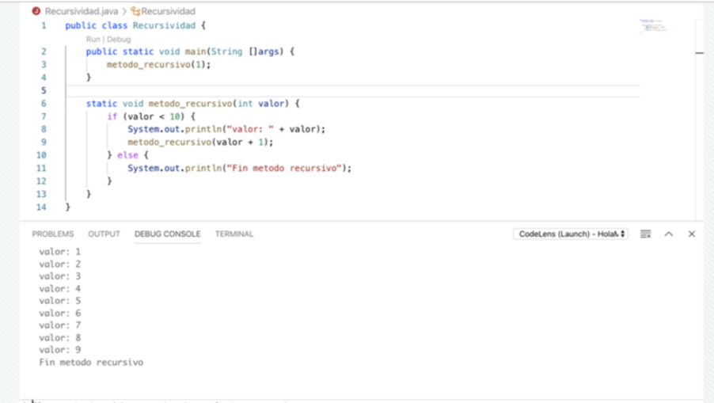
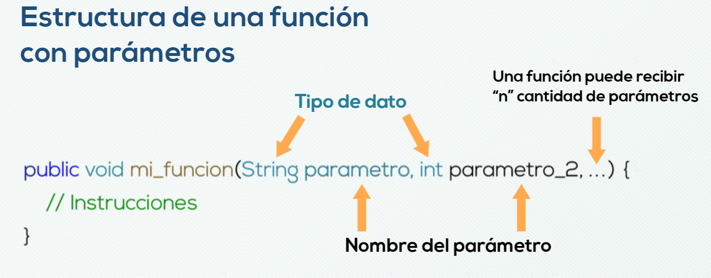
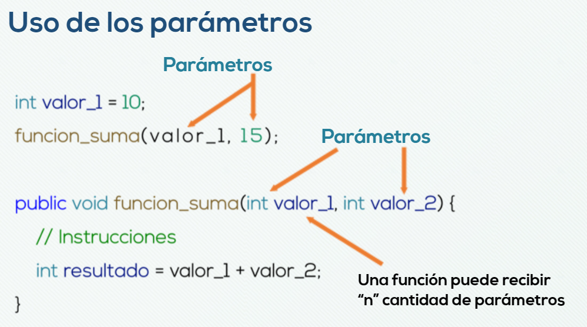
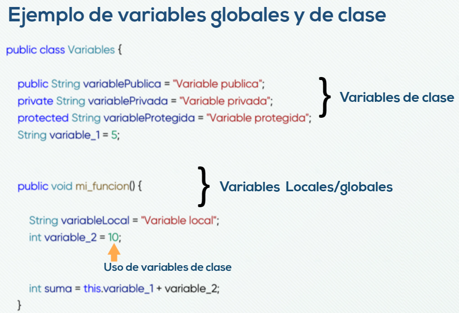
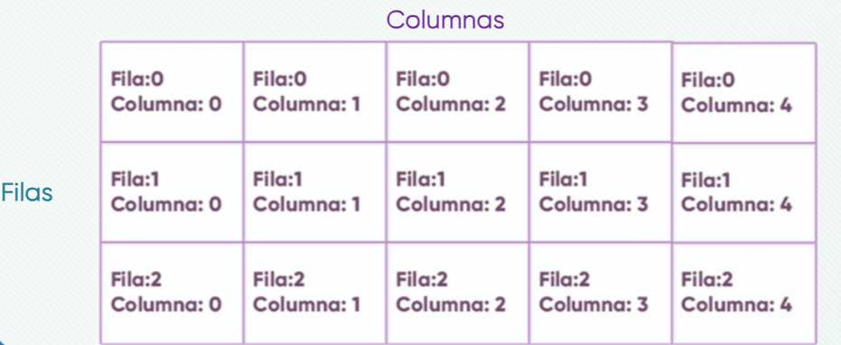
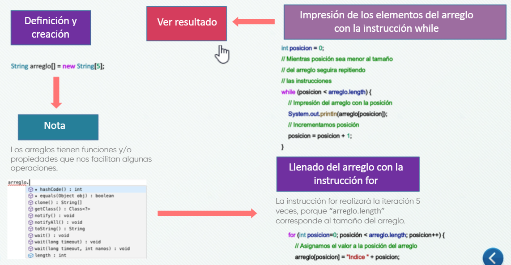
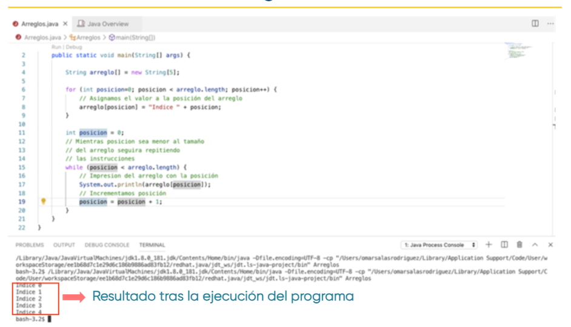

# Introducción al lenguaje de programación Java 


##  Declarar clases
`public class Hola { 
    ...
}` 


## Declarar metodos 
`public static void main (String [] arg){
        ...
}`

>*_Los métodos son las funciones o procedimientos. El método principal y por donde inician los programas es el método main_*

### Método main(): 
* Publico (public), puedes ser llamado desde cualquier lado. 
* Estático (static), puede ser llamado sin necesidad de instanciar la clase. 
* Vacío (void), no devuelve ningun valor 
* (String [] args), admite una serie de parametros, en este caso ninguno 
* El metodo se delimita entre llves {}

## Comentarios en código 


* // cometarios de una sola linea 
* /* "Texto" */ comentarios en varias lineas  

## Sentencias (instruccion que se ejecutará)
`System.outprintln("Hola");`

 > Clase System con el atributo out con el metodo println      


## Tipos de datos 

| Tipos de datos primitivos | Información representada | Rango      |
|---------------------------|--------------------------|------------|
|**byte**                   |Datos enteros             |-128 al +127
|**short**                  |Datos enteros             |-32.768 al +32.767
|**int**                    |Datos enteros             |-2147483648 al +2147483647
|**long**                   |Datos enteros             |-9223372036854775808 al +9223372036854775807
|**char**                   |Datos enteros y caracteres|0 al 65535  |   
|**float**                  |Datos en coma             |Flotante en 32 bits|
|**double**                 |Datos en coma             |Flotante en 64 bits|
|**boolean**                |Valores booleanos         |True/False
----------------------------------


## Variables de Clase 

* Son variables cuyo valor es el mismo para la clase y para todas las instancias.
* Palabra reservada _static_ se utiliza para la declaración de variables de clase 

## Variables locales 

* Son variables declaradas dentro de un método, se crean cuando el bloque inicia y se destruyen cuando finaliza la ejecución de dicho bloque. 

#### Ejemplo : 
```
class suma {
    static int a=50; //Variable de clase

    public static void main (String[] args){
        int b=10, resultado=0; //Variables locales
        resultado = a+b;
        System.out.println("Elresultado de la suma es:"+ resultado);
     }
 } 
 ```

## Constantes 
> Lugar de memoria donde se puede almacenar información, se le diceconstante por que su valor no puede cambiar durante toda la ejecución del programa. 

### Declarar una constante 
`final double PI = 3.1416;`
> tipo de dato, nombre de variable, valor  

#### Ejemplo:
```
class AreaCirculo {
    public static void main (String [] args){
        final double PI=3.1416; // Constante 
        double radio = 3.5, area;
        area = PI*radio*radio;
        System.out.println("El área del circulo es: "+ area);
    }
} 
```

## Operadores Aritméticas 

| Operador        |Operación |
|-----------------|----------|
|+                |Suma      |
|-                |Resta     |
|*                |Multiplicación|
|/                |División  |
|%                |Módulo o resto de una división |


#### Ejemplo: 
``` 
int a=2, b=5, resultado;
resultado =a*b; //resultado=10
```

## Racionales 
Evaluan la igualdad y la magnitud 

| Operador        |Operación        |
|-----------------|-----------------|
|<                |Menos que        |
|>                |Mayor que        |
|<=               |Menor o igual a  |
|>=               |Mayor o igual a  |
|!=               |Distinto         |
|==               |Igual que        |
 


#### Ejemplo: 
``` 
int a=6, b=8;
boolean resultado;
resultado = a>b; // resultado = False
``` 
## Unitarios 
Pueden realizar operaciones lógicas.

| Operador        |Operación |
|-----------------|----------|
|&& o &           |Elresultado será true si ambos son true y    false en caso contrario       
| ll o l          |el resultado seá false si ambos operadores son false y true en caso contrario.      |
|!                |si el operando es true el resultado es false y si el operando es false el resultado es true|
|^                |El resultado será true si un operando es true y el otro false, y false en caso contrario   |
-----------------------------------------------------

#### Ejemplo: 
``` 
int =3, b=6;
boolean resultado;
resultado = a>b && a >= b;  //Resultado = false
```

## Lógicos 

| Operador        |Operación                   |
|-----------------|----------------------------|
|~                |Complemento A1              |
|-                |Cambio de signo del operador|
|--               |Decemento                   |
|++               |Incremento                  |


#### Ejemplo: 
``` 
int a=3, b=6;
a++; //a incrementa a = 4
b--; //b decrementa b = 5
```

## Asignación
| Operador        |Operación                   |
|-----------------|----------------------------|
|=                |Asignación                  |
|+=               |Suma de asignación          |
|-=               |Resta de asignación         |
|*=               |Multiplicación y asignación |
|/=               |División y asignación       |
|%=               |Módulo y asignación         |

#### Ejemplo:
``` 
int a = 15;
a += 5; // a = 20, equivale a a= a+5
```


## Instrucciones if-else

> La estructura if permite ejecutar un bloque de código si se cumple la condición 

``` 
if (condicion){
        // si cumple la condición 
}
```

>La estructura if-else cuenta con un bloque de código cuando falla la decisión 

``` 
if(condicion){
    // Si es verdadero 
}else{
    // Si es falso
}
```

> La estrucutura if-else-if acepta dos o más condiciones 

``` 
if (condicion){
    // Si es verdadero
}else if(condicion){
    // Si es verdadero 
}else if (condicion){
    // Si es verdadero
}else{
    // Si es falso
}
```

> La estructura if-else anidada permite tener más condiciones internamente 

``` 
if (condicion){
    // Si es verdadero
        if(condicion){
            //Si es verdadero
        }
}else{
    //Si es falso
        if(condicion){
            //si es verdadero
        }else{
            //si es falso
        }
}
```


### Ejemplos: 
### if
> Entra al bloque "if" solo cuando la edad es menor a 30 
``` 
int edad = 35;
if(edad<30) {
    //Cuando la edad es menor a 30 
}
```

### if else 
> Entra al bloque "if" solo cuando la edad es menor a 30, de lo contrario entra al bloque "else". 

``` 
int edad=35;

if(edad<30){
    //Cuando la edad es menor a 30
}else{
    //Cuando la edad es mayor a 30 
}
```


### if else if
> Se puede crear una estructura con diferentes casos, como se muestra en el código:
```
int edad=20;
if(edad<18){
    //Cuando la edad es menor a 18
}else if(edad>25){
    //Cuando la edad sea mayor a 25
}else{
    /*
    Cuando la edad este entre 18 y 25 o visto de otra forma, cuando no entro en ninguna de kas cindiciones pasadas
    */
}
```

### if else - anidadas 
> las instrucciones pueden anidarse para hacer múltiples validaciones, en este ejemplo ppodemos observar cómo entra en el bloque "else" porque la edad es mayor a 30, para luego entrar en el bloque  "if" que estáanidado dentro de esta, porque nombre es igual a juan.

``` 
int edad -35;
String nombre = 'Juan';
if (edad<30){
    //Cuando la edad es menor a 30 
}else{
    //Cuando la edad es mayor a 30 
    if(nombre==='Juan'){
        //Cuando nombre es igual a Juan
    }else{
        //Cuando nombre sea diferente de juan
    }
}
```
## Estructura switch

>La estructura switch es utilizada para comparar un valor con una serie de casos. Donde se compara el valor con cada uno de los "case", si el valor coincide con algunos de los casos, este es ejecutado. 

``` 
switch (valor){
    case 'caso_1':{
        //Ejecuta el caso 1
        break
    },
    case 'caso_2':{
        //Ejecuta el caso 2 
        break
    }
    ...
    default:
        /*En caso de no encontrar coincidencia ejecuta este caso*/
        break;
        
}
```

### Instrucciones switch 

>Ejemplo cuando coincide con alguno de los casos definidos.
En este caso como "mes" es igual a "febrero" entra en "case  'febrero'"

``` 
String mes = 'febrero';
switch (mes){
    case 'enero':
        //Cuando mes es igual a enero 
        break;
    case 'febrero':
        //Cuando mes es igual a febrero
        break; 
    case 'marzo':
        //Cuando mes es igual a marzo 
        break; 
    default:
        //Cuando no entro en ninguna de los casos
        break;
}
```

>Ejemplo cuando coincide con alguno de los casos definidos. En este caso como "mes" no coincide con ninguno de los casos definidos, por defecto entra en el bloque "default"

``` 
String mes='noviembre';
switch (mes){
    case 'enero':
        // Cuando mes es igual a enero
        break; 
    case 'febrero':
        //Cuando mes es igual a febrero
        break; 
    case 'marzo':
        //Cuando mes es igual a marzo
        break;
    default:
        //Cuando no entro en ninguno de los casos
        break;
    
}
``` 
## Estructuras iterativas 
## Instrucciones for
>Las instrucciones for nos permiten ejecutar varias veces un bloque de código y su estructura es la siguiente: 
``` 
for (inicializacion; condicion;
actualizacion){
    //Sentencias a ejecutar
}
```
Donde: 

INICIALIZACIÓN: Es la declaración e inicialización de las variables

CONDICIÓN: Es la condición que se evalúa en cada iteración  

ACTUALIZACIÓN: Es la modificación de la variable que deben cumplir con la condición. 

#### Ejemplo:
``` 
for (int i = o;i<5;i++){
    //Sentencias a ejecutar
    System.out.,println('i:'+ i);
}
```
### Instrucciones while 
>Las instrucciones while se ejecuta mientras el valor de la confición sea verdadera.
La condición se evalúa antes de la primera iteración. 

``` 
while (condicion){
    //Sentencias a ejecutar
}
```
>El bucle que se estará repitiendo mientras el valor sea menor a 10, y el valor se invrementará a uno en cada repetición. 
``` 
int valor = 0 ;
while (valor<10){
    valor = valor + 2
}
```
Representación de la variable "valor" en cada iteración


|ITERACIÓN   | VALOR |
|------------|-------|
|INICIAL     |   0   |
|1           |   2   |
|2           |   4   |
|3           |   6   |
|4           |   8   |
|5           |  10   |
|6           |   -   |

>La iteración número 6 ya no se ejecuta porque el valor no es menor a 10 


## Recursividad 

> La recursividad es una técnica de la cual un método se manda llamar a si mismo en algún momento de su ejecución.

``` 
imprimirValor (valor)
    mostrar(valor);
    si valor es menor a 10 
        llamar imprimirValor(valor+1)
    en caso contrario
        terminar
```

Método que se manda llamar a si mismo mientras el valor sea menor a 10, y el valor se incrementará a uno en cada repetición 

> Nota: La palabra static es un modificador con el cual podemos acceder al método desde nuestro main

En la siguiente imagen se ve el resultado de la recursividad : 




## Declarar Funciones 

> #### Las funciones sin un bloque de código (instrucciones), las cuales realiazan tareas especificas a las que nombran mediante su respectivo nombre.

#### Estructura

    ``` 
    modificador_de_control_de_acceso tipo_de_dato nombre_del_metodo(){
        //instrucciones
    }
    ```

#### Ejemplo :
``` 
public void mi_primer_metodo(){
    // instrucciones
}
```

## Modificadores de control de acceso 

> #### Son los encargados de controlar el acceso, ya sea permitiendo o denegando una función a una clase.

#### Tabla: Modificadores de  control de acceso 

|Modificador de control de acceso|Desde otro paquete (package)|Desde el mismo paquete (package)|Clase(class)|Subclase|
| -- | -- | -- | -- | -- |
|Público(public)                 |          o                 |              o                 |     o      |    o   |
|Privado(private)                |          x                 |              x                 |     o      |    x   |
|Protegido(protected)            |          x                 |              o                 |     o      |    o   |
|Default(deafult)                |          x                 |              o                 |     o      |    x   |

### Aplicación de los modificadores de control de acceso 

> Público (public)
``` 
public class MiClase{

}
```

>Protegido (protected)
``` 
public class MiClase {
    protected String miVariable = "Variable privada"
}
```

>Privado (private)
``` 
public class MiClase {
    protected String miVariable = "Variable privada"

    private void mi_funcion_privada(0){
        //Instrucciones
    }
}
```
## Tipos de datos 
> #### Son utilizados para definir los valores que pueden tomar las variables. Algunos  ejemplos de estos  son textos, números enteros, decimales y boleanos, entre otros.

### Parámetros 

Un parámetro es la expansión de la variable a otro ámbito. Los parámetros son utilizados para recibir valores que después pueden ser usados para realizar operaciones dentro de una función. 
Para hacer uso de estos parámetros se envían argumentos, donde un argumento es el valor que se envía. 






#### Ejemplo de funciones con parámetros 

>Función sin parámetros 
``` 
public void funcion(){

}
```
> Función con un parámetro
``` 
public void funcion(int parametro){

}
```
> Función con "n" número de parámetros 
``` 
public void funcion (int parametro, String parametro_2,...){

}
```

## Variables locales y de clase 

Las variables de clase, o también llamadas globales, resultan útiles cuando se quiere tener acceso a una variable en cualquier fragmento de código dentro de la clase, o del paquete, dependiendo del modificador de control de acceso que se le asigne. 
Mientras qu elas variables locales son declaradas y usadas dentro del bloque de código. 



## Retorno de valores 
Las funciones no solo pueden realizar tareas y quedarse con la información generada, también pueden devolver esos resultados. 


#### Aplicación de retorno de valores 
>Retorna un número entero 
``` 
public int ObtenerUnNumero(){
    return 1;
}
```
> Retorna un número decimal 
``` 
public double ObtenerDecimal(){
    return 9.94;
}
```
>Retorna un texto 
``` 
public String ObtenerUnaCadena(){
    return "Hola Mundo!";
}
``` 
> Retorna un boleano 
``` 
public boolean obtenerBoleano(){
    return true;
}
```

## Arreglos 
Los arreglos son una lista de datos del mismo tipo, las cuales nos sirven para agrupar variables. Es decir, imaginemos qie tenemos una lista de"n" número de alumnos, no creariamos una variable para cada alumno, más bien, en su lugar crearíamos un arreglo

>Asignación de usuarios a su respectiva variable 

``` 
String alumnoJuan = "Juan Pérez";
String alumnoJuan = "Raúl Rodriguez";
String alumnoJuan = "josé Morales";
```
**_Es complicado definir tantas variables para cada alumno distinto_**
 ### Declaración y creación 
**_Podemos definir un arreglo de cualquiera de las siguientes dos formas:_**
 ``` 
 int nombre_1;
 int nombre_2;
 ```
**_Definición y creación de una linea_**
``` 
int nombre_1 = new int[5];
int nombre_2 = new int [5];
```
**_Creación_**
``` 
int nombre_1 = new int[5];
int nombre_2 = new int [5];

```
>_Donde 5 es el máximo de datos a almacenar_

## Arreglos unidimencionales 

Son objetos donde podemos almacenar varios valores, todos apuntando a la musma variable, diferenciados por su posición mejor conocida como índice. 

#### Así se ve un arreglo unidimenconal 


| tipo int | 0 | 1 | 2 | 3 | 4 | 5 |
| -- | -- | -- | -- | -- | -- | -- |

|tipo String|"indice 0" |"indice 1" |"indice 2" |"indice 3" |"indice 4" |"indice 5" |
| -- | -- | -- | -- | -- | -- | -- |

## Arreglos bidimensionales 

Se define un arreglo bidimensional como una matriz de filas y columnas. 

``` 
String arregloBidimencional = new String[3][5]; 
```


## Recorrido de un arreglo 

Para hacer el recorrido de los elementos de un arreglo usamos las funciones iterativas (for, while, do-while, etc) 




Fin :pencil: